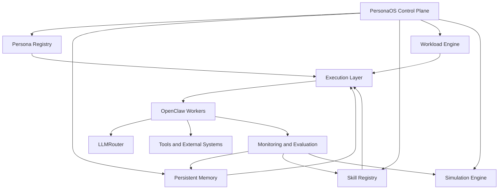
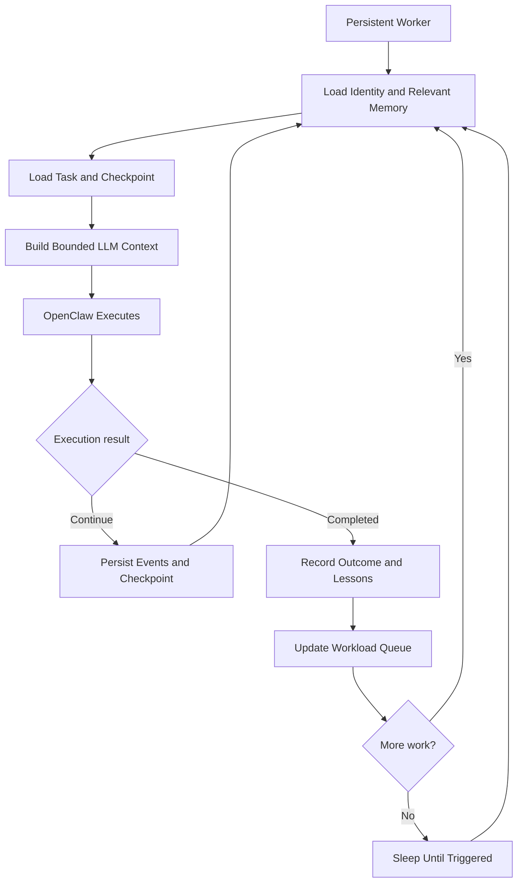

> **Build workers. Preserve experience. Simulate work.**
> 

## 1. Vision

PersonaOS is a persistent workforce operating system for AI agents. It models each AI worker as a long-lived digital employee with an identity, skills, accumulated experience, workload, and measurable performance.

Workers can receive tasks, collaborate with other workers, learn from previous executions, and be simulated before real work is dispatched.

**Core principle:** separate worker identity, experience, and workload from the LLM and agent engine. A worker should survive model changes, engine restarts, and changes to available tools.

## 2. Core concepts

- **Identity** — role, personality, goals, authority, and reporting line.
- **Skills** — specialized capabilities that can be installed, tested, versioned, and upgraded.
- **Memory** — persistent knowledge, task history, experience, decisions, and lessons learned.
- **Workload** — tasks, priorities, dependencies, deadlines, capacity, and working patterns.
- **Simulation** — model how workers perform, how teams collaborate, and where bottlenecks may occur.
- **Orchestration** — coordinate multiple workers, manage handoffs, and ensure work reaches completion.
- **Self-monitoring** — observe worker health, quality, cost, reliability, and skill security.

## 3. Proposed architecture



### Control plane responsibilities

- Worker lifecycle and durable state management.
- Task scheduling, prioritization, dependencies, retries, and checkpoints.
- Memory retrieval and updates.
- Skill and permission governance.
- Model and tool routing integration.
- Observability, evaluation, and simulation.
- Recovery after failures and restarts.

## 4. Selected components and integration roles

| Component | Proposed role | Integration notes |
| --- | --- | --- |
| OpenClaw | Core agent execution engine | Execute conversations, invoke tools, and perform assigned work. |
| LLMRouter | LLM routing | Route requests to suitable models according to capability, cost, and performance. Validate deployment and integration requirements. |
| NVIDIA SkillSpector | Skill security inspection | Evaluate its current capabilities and integrate it into skill admission and security checks; do not treat it as the entire workforce-monitoring solution. |
| oc-tools | Tool collection | Audit available tools, interfaces, permissions, and compatibility before adopting them. |
| **PersonaOS (new)** | Persistent workforce layer | Own persona records, memory, workload state, coordination, simulation, and governance. |

**Architecture decision:** build the workforce layer around these components rather than merging all of them into a monolith. Keep integrations replaceable behind adapters.

## 5. The persistent worker model

A worker is more than a system prompt plus an LLM session. Its durable state should include:

1. **Identity:** stable worker ID, role, objectives, personality configuration, authority, and team membership.
2. **Skills and competence:** installed skill versions, capability descriptions, permissions, test results, and trust level.
3. **Experience and memory:** prior tasks, outcomes, decisions, evidence, failures, and reusable lessons.
4. **Workload and state:** assigned tasks, queue, commitments, dependencies, blockers, checkpoint, and current execution status.
5. **Performance model:** completion rate, task duration, quality, retries, error patterns, and escalation behavior.

This separation lets a worker be paused, resumed, cloned, evaluated, or moved to a different model without losing its accumulated experience.

## 6. Memory architecture

Use distinct memory categories instead of relying on one giant conversation transcript.

- **Working memory:** context needed for the current task or execution cycle.
- **Episodic memory:** records of tasks, actions, decisions, outcomes, and incidents.
- **Semantic memory:** durable facts about systems, projects, users, and domain knowledge, with provenance.
- **Procedural memory:** reusable workflows, strategies, and lessons learned.
- **Worker profile:** stable identity, preferences, responsibilities, and operating constraints.

Memory writes should be traceable. Record source, timestamp, confidence, and applicable scope. Detect stale or conflicting facts; avoid turning every model-generated statement into trusted memory.

## 7. Keeping conversations alive indefinitely

The goal is persistent execution and continuity, not an infinitely growing LLM context window. Model context remains finite; PersonaOS reconstructs relevant context from durable state whenever a worker resumes.



Persist task status, decisions, tool results, pending actions, dependencies, memory changes, and resumable checkpoints. Use durable queues, event-driven wakeups, and scheduled jobs. Avoid relying on a single long-running LLM request.

## 8. Workload and orchestration model

Each task should have a durable ID and explicit lifecycle, for example:

- **Queued** — ready for assignment.
- **Assigned** — owned by a worker.
- **In progress** — execution has started.
- **Blocked** — waiting for a dependency, decision, or external system.
- **Review** — output needs validation or approval.
- **Completed** — acceptance criteria are met.
- **Failed** — retries exhausted or execution cannot continue.
- **Canceled** — explicitly stopped.

The scheduler should consider priority, required skills, availability, workload, deadlines, dependencies, cost, and historical performance. Critical actions should have permission boundaries and approval gates.

## 9. Self-monitoring and evaluation

Build workforce monitoring separately from skill security scanning.

| Area | Measurements |
| --- | --- |
| Worker health | Alive, idle, busy, blocked, failed |
| Task performance | Completion rate, duration, retries, acceptance quality |
| Memory quality | Retrieval relevance, stale facts, conflicts, provenance |
| Skill quality | Success rate, version regressions, security findings |
| Cost efficiency | Tokens, model cost, cost per accepted task |
| Collaboration | Handoffs, duplicated work, dependency delays, bottlenecks |

Use execution traces, structured task outcomes, periodic health checks, and regression tests. Skill security scanning should be part of the skill admission pipeline, not a substitute for runtime observability.

## 10. Simulation: the key differentiator

PersonaOS should eventually model a team before dispatching real work.

Example software delivery team:

- **CTO / Architect:** architecture, prioritization, technical decisions.
- **Developer:** implementation, debugging, and code changes.
- **DevOps:** infrastructure, deployment, and automation.
- **QA:** test design, regression checks, and release verification.

The simulation engine should estimate task duration, capacity, likely failure points, handoff overhead, dependencies, and cost using historical execution data and explicit assumptions.

Start with workload replay and scenario comparison. Calibrate estimates against real outcomes and clearly distinguish simulated estimates from measured performance.

## 11. Recommended implementation stack

| Layer | Initial choice | Purpose |
| --- | --- | --- |
| Control plane | Python API service | Worker lifecycle, orchestration, scheduling |
| Durable state | PostgreSQL | Workers, tasks, events, checkpoints, skill versions |
| Semantic retrieval | pgvector | Similarity search over selected memories |
| Task execution | OpenClaw | Run agent work and use tools |
| Model routing | LLMRouter | Model selection and routing |
| Tool integration | Adapter interface | Keep external tools replaceable |
| Monitoring | Structured traces and metrics | Health, reliability, cost, and quality |
| Simulation | Replay and scenario engine | Compare workload plans and team configurations |

Start with a modular monolith and clear interfaces. Introduce separate services or additional infrastructure only when real workload and reliability requirements justify them.

## 12. MVP roadmap

### Phase 1 — Persistent foundation

- [ ]  Define worker and task schemas.
- [ ]  Implement Persona Registry and versioned worker profiles.
- [ ]  Implement durable workload queue and task lifecycle.
- [ ]  Store execution events and resumable checkpoints.
- [ ]  Define the OpenClaw adapter.

### Phase 2 — Memory and continuity

- [ ]  Implement working, episodic, semantic, and procedural memory.
- [ ]  Add context assembly and retrieval policies.
- [ ]  Record provenance and confidence for memory entries.
- [ ]  Resume tasks after process restart and failed execution.
- [ ]  Test for duplicate actions and unsafe retries.

### Phase 3 — Skills and observability

- [ ]  Build a versioned Skill Registry.
- [ ]  Add skill validation and security scanning.
- [ ]  Track task quality, latency, retries, and costs.
- [ ]  Add worker and workload dashboards.
- [ ]  Implement permission boundaries and human approval gates.

### Phase 4 — Team orchestration and simulation

- [ ]  Support multiple worker roles and task handoffs.
- [ ]  Model dependencies and capacity constraints.
- [ ]  Replay historical tasks.
- [ ]  Compare alternative team assignments and model choices.
- [ ]  Calibrate estimates against actual execution.

## 13. Architectural decisions to settle

1. **Standalone control plane vs. deep OpenClaw fork:** recommended — standalone PersonaOS control plane with OpenClaw adapters.
2. **Memory ownership:** PersonaOS owns durable workforce memory; OpenClaw session memory is an execution convenience, not the source of truth.
3. **Worker identity across models:** use stable worker IDs and versioned profiles independent of provider-specific conversation IDs.
4. **Execution recovery:** durable checkpoints and idempotent task actions, with explicit handling for side effects that cannot be safely repeated.
5. **Learning governance:** lessons can be proposed automatically, but consequential profile or skill changes should be evaluated before promotion.
6. **Simulation validity:** label estimates, record assumptions, and calibrate against observed outcomes.

## 14. Initial success criteria

The first release should demonstrate that:

- A worker can resume after an engine restart without losing task state.
- Relevant memory can be retrieved across separate sessions.
- Tasks cannot silently disappear from the durable queue.
- Failed tasks can be retried without blindly duplicating side effects.
- Multiple workers can hand work to each other with traceable ownership.
- Monitoring exposes task outcomes, reliability, latency, and cost.
- A workload replay can compare at least two team configurations.

## Summary

PersonaOS should be the source of truth for worker identity, accumulated experience, workload, and governance. OpenClaw executes the work, LLMRouter selects models, and external tools provide capabilities.

The long-term goal is a workforce that continuously operates, preserves experience across sessions and model changes, coordinates as a team, and can simulate alternative ways of working before real execution.

# Cluster Support

PersonaOS should support AI workers as a distributed cluster rather than assuming a single-machine deployment.

## Cluster Model

```
                 PersonaOS Control Plane
                        │
       ┌────────────────┼────────────────┐
       │                │                │
   Scheduler       Worker Registry    Memory DB
       │                │                │
       └────────────────┼────────────────┘
                        │
                 Event / Task Bus
                        │
     ┌──────────────────┼──────────────────┐
     │                  │                  │
Worker Node A      Worker Node B      Worker Node C
OpenClaw           OpenClaw           OpenClaw
Runtime            Runtime            Runtime
     │                  │                  │
Models/Tools       Models/Tools       Models/Tools
```

## Cluster Requirements

- Worker discovery and registration
- Distributed scheduling based on skills, priority, capacity, cost, and availability
- Persistent state outside worker nodes
- Failover and checkpoint-based task resume
- Horizontal scaling
- Load balancing
- Capability-aware routing for GPU/model/tool-specific workloads
- Cluster and worker health monitoring

## Worker vs Node

A key PersonaOS abstraction is to separate a **Worker** from a **Worker Node**.

- **Worker** = persistent digital employee: identity, role, skills, memory, experience, workload, permissions.
- **Worker Node** = compute/runtime location where the worker executes.

A worker may move from Node A to Node B without losing identity or experience.

```
Worker: devops-01
       │
       ├── Identity
       ├── Skills
       ├── Memory
       ├── Experience
       └── Current Task
              │
              ▼
       Runtime Assignment
              │
       ┌──────┴──────┐
       ▼             ▼
   Node A          Node B
 OpenClaw        OpenClaw
```

## Cluster Architecture Layers

### 1. Control Plane

Authoritative state for the AI workforce:

- Worker registry
- Task/workload registry
- Skill registry
- Policy and permissions
- Scheduling
- Cluster membership
- Checkpoints
- Observability

### 2. Event / Task Bus

Use a durable queue/event mechanism for task dispatch, worker wake-up, completion/failure events, heartbeats, memory events, and scheduled work. The system should not depend on one permanently running LLM conversation.

### 3. Worker Nodes

Each node runs one or more execution workers and can host OpenClaw, local or remote LLM access, specialized tools, browser/terminal execution, and GPU workloads.

### 4. Shared Persistence

Initial recommendation:

- PostgreSQL — authoritative state
- pgvector — semantic memory
- Redis/NATS/RabbitMQ — queue/event layer depending on requirements
- Object storage — large artifacts, logs, datasets, checkpoints

### 5. Model Routing

LLMRouter remains below PersonaOS. PersonaOS decides **which worker should perform the work**; the worker/runtime can decide **which model should perform each reasoning step**.

```
PersonaOS → Worker → OpenClaw → LLMRouter → Models
```

## Cluster Scheduling

Initial task placement can use deterministic rules:

1. Required skill match
2. Permission/capability match
3. Worker availability
4. Current workload
5. Node health
6. Model/tool availability
7. Cost/latency preference

Later, historical performance and simulation can improve scheduling.

## Fault Tolerance

Every long-running task should have a durable checkpoint containing current state, completed steps, pending actions, decisions, tool results, memory updates, retry count, and assigned worker/node.

```
Node A failure
     ↓
Heartbeat timeout
     ↓
Task marked recoverable
     ↓
Scheduler finds compatible node
     ↓
Load checkpoint
     ↓
Resume task
```

## Cluster MVP

Do not make Kubernetes a hard dependency initially. Build a lightweight PersonaOS cluster protocol first:

- PersonaOS API/control plane
- PostgreSQL
- Durable task queue
- Worker registration API
- Worker heartbeat
- OpenClaw worker adapter
- Task lease/lock
- Checkpoint/resume
- Basic scheduler
- Node health monitoring

Then run:

```
PersonaOS Control Plane
        │
   ┌────┴────┐
   │         │
 Node 01   Node 02
 OpenClaw  OpenClaw
 Worker A  Worker B
```

Kubernetes can later become an optional deployment layer for large clusters rather than being part of the core PersonaOS abstraction.

## Long-Term Vision

PersonaOS should manage an AI workforce across multiple machines, GPUs, models, cloud providers, and execution runtimes while preserving the same worker identity and accumulated experience.

**Core principle: compute is replaceable; the worker is persistent.**

# AI-Native Security & Governance

PersonaOS should treat security as a first-class operating-system capability, not as an optional add-on. Because PersonaOS controls persistent AI workers, their identity, memory, skills, tools, secrets, workload, and execution, it must control what those workers are allowed to do.

## Three AI Threat Directions

### 1. AI attacking the organization

Protect the organization from AI-enabled attacks:

- AI-aware identity and access control
- Zero-trust worker and application access
- Bot and automation detection
- AI phishing awareness and email security integration
- DLP for AI interactions
- Data classification
- Approved AI / shadow-AI governance
- AI usage auditing

### 2. People or AI tools misusing organizational data

PersonaOS should provide policy enforcement between users/workers and AI systems:

- Public / Internal / Confidential / Secret classification
- Prevent sensitive data from reaching unapproved AI providers
- Approved-model/provider policies
- Prompt and response auditing where policy permits
- Secret and credential detection
- Vendor/model trust policies

### 3. Attacks against AI workers and AI infrastructure

Protect PersonaOS itself and its workers:

- Worker identity
- Node authentication
- RBAC and least privilege
- Tool allowlists
- Secret isolation
- Skill verification
- Model/provider policies
- Resource quotas
- Audit trails
- Anomaly detection
- Worker quarantine
- Emergency kill switch

## AI Worker Firewall

A core PersonaOS capability should be an **AI Action Firewall**. It evaluates an action before a worker executes it.

```
Worker wants to perform an action
            ↓
      AI Action Firewall
            ↓
 ┌────────────────────────────┐
 │ WHO?       Worker identity │
 │ WHAT?      Requested action │
 │ WHERE?     Target resource  │
 │ WHY?       Task/objective   │
 │ WITH WHAT? Tool/credential  │
 │ RISK?      Action risk      │
 │ AUTHORITY? Worker policy    │
 └──────────────┬─────────────┘
                ↓
       ┌────────┴────────┐
       │                 │
    Allowed          Approval/Block
       │                 │
       ↓                 ↓
    Execute          Human review
```

Example:

```
DevOps Worker

CAN:
✓ SSH staging
✓ Read GitLab
✓ Deploy Kubernetes
✓ Restart services

CANNOT:
✗ Read production database passwords
✗ Delete production cluster
✗ Access finance systems
✗ Send unrestricted external email
✗ Create unlimited cloud resources
```

The policy engine should evaluate identity, requested action, target, task context, tool, credential, risk, and authority before execution.

## Security Architecture

```
                         PersonaOS
┌──────────────────────────────────────────────────────────┐
│                                                          │
│  Identity       Workers        Skills       Memory       │
│                                                          │
│  Workload       Scheduling     Simulation   Experience   │
│                                                          │
│  Security       Policy         DLP          Audit        │
│                                                          │
│  Tool Gateway   Secrets        Quotas       Kill Switch  │
│                                                          │
│  Cluster        Nodes          Monitoring   Recovery     │
│                                                          │
└──────────────────────────┬───────────────────────────────┘
                           │
                     Runtime Layer
                           │
                       OpenClaw
                           │
                ┌──────────┼──────────┐
                │          │          │
              LLMs       Tools      APIs
```

## Security as an OS Primitive

PersonaOS core primitives should now be:

1. **Worker** — persistent digital employee identity
2. **Workload** — tasks, priorities, capacity, dependencies
3. **Memory** — persistent knowledge and experience
4. **Execution** — runtime and tool execution
5. **Simulation** — workforce and scenario modeling
6. **Security** — identity, policy, permissions, isolation, governance

This makes PersonaOS more than an agent framework. It becomes an operating system for persistent, distributed, governed AI labor.

## Security MVP

Security should be built into the first usable version, but the initial implementation should remain small:

1. Worker identity
2. RBAC / permissions
3. Tool allow/deny policies
4. Secret isolation
5. Task-level audit log
6. Human approval for high-risk actions
7. Worker quarantine / kill switch
8. Node authentication

Later capabilities:

- DLP
- AI gateway
- Prompt-injection detection
- Shadow-AI detection
- SIEM integration
- Anomaly detection
- AI red teaming
- Compliance controls

## Core Thesis

> **PersonaOS is an operating system for persistent AI workers, managing identity, skills, memory, workload, execution, security, and coordination across a distributed AI workforce.**
> 

The key advantage is that the worker remains persistent while the underlying compute, model, runtime, or node can change.

**Core principle: compute is replaceable; the worker is persistent; every action is governed.**
